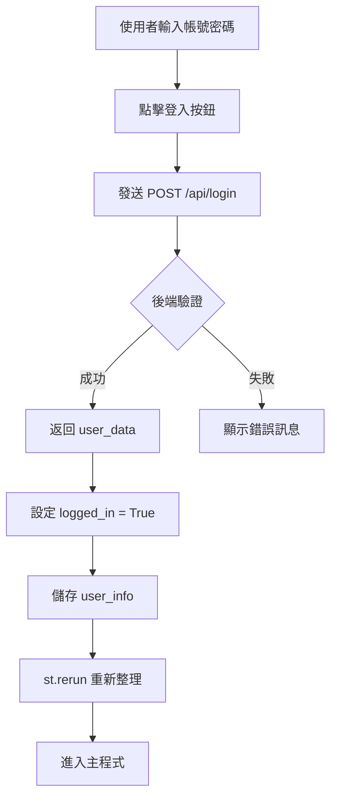

# 系統 State 管理說明文件

## 📋 概述

您的 StockAI-Assistant 系統目前使用 **Streamlit Session State** 來管理使用者狀態，**沒有使用 Cookie**。

## 🔍 State 系統架構

### 1. Session State 初始化

**位置**：[app.py 第 193-197 行](file:///c:/Users/hankl/Desktop/dev/StockAI-Assistant/frontend/app.py#L193-L197)

```python
# --- 初始化 Session State ---
if "logged_in" not in st.session_state:
    st.session_state.logged_in = False
if "user_info" not in st.session_state:
    st.session_state.user_info = {}
```

### 2. State 變數說明

| 變數名稱 | 類型 | 用途 | 預設值 |
|---------|------|------|--------|
| `logged_in` | `bool` | 記錄使用者是否已登入 | `False` |
| `user_info` | `dict` | 儲存使用者資料 | `{}` |

#### `user_info` 結構

登入成功後，`user_info` 會包含以下資料（從後端 API 返回）：

```python
{
    "id": 1,                    # 使用者 ID
    "username": "張三",         # 使用者名稱
    "account": "user123",       # 帳號
    "api_token": "sk-xxx...",   # Gemini API Token
    "created_at": "2024-01-01"  # 建立時間
}
```

## 🔐 登入流程

### 登入過程

**位置**：[app.py 第 213-227 行](file:///c:/Users/hankl/Desktop/dev/StockAI-Assistant/frontend/app.py#L213-L227)



**關鍵程式碼**：
```python
if res.status_code == 200:
    user_data = res.json()
    st.session_state.logged_in = True      # 設定登入狀態
    st.session_state.user_info = user_data # 儲存使用者資料
    st.success(f"歡迎回來，{user_data['username']}！")
    st.rerun()  # 重新整理頁面
```

### 登入檢查

**位置**：[app.py 第 1276-1279 行](file:///c:/Users/hankl/Desktop/dev/StockAI-Assistant/frontend/app.py#L1276-L1279)

```python
# 程式進入點
if st.session_state.logged_in:
    main_controller()  # 顯示主功能
else:
    login_page()       # 顯示登入頁面
```

## 🍪 Cookie 狀況

> [!IMPORTANT]
> **目前系統沒有使用 Cookie！**

### 現況分析

1. **無 Cookie 實作**
   - 搜尋整個 frontend 目錄，沒有找到任何 cookie 相關程式碼
   - 沒有使用 `streamlit-cookies-manager` 或類似套件

2. **Session State 的限制**
   - ⚠️ **不持久化**：重新整理頁面或關閉瀏覽器後，登入狀態會消失
   - ⚠️ **僅存在於記憶體**：資料不會儲存到瀏覽器
   - ⚠️ **每次都要重新登入**：使用者體驗較差

## 📊 State 使用位置

### 讀取 `user_info` 的地方

1. **個人設定頁面** ([app.py 第 261 行](file:///c:/Users/hankl/Desktop/dev/StockAI-Assistant/frontend/app.py#L261))
   ```python
   user = st.session_state.user_info
   ```

2. **操盤分析頁面** ([app.py 第 311 行](file:///c:/Users/hankl/Desktop/dev/StockAI-Assistant/frontend/app.py#L311))
   ```python
   user = st.session_state.user_info
   saved_token = user.get("api_token") or ""
   ```

3. **歷史紀錄頁面** ([app.py 第 498 行](file:///c:/Users/hankl/Desktop/dev/StockAI-Assistant/frontend/app.py#L498))
   ```python
   user = st.session_state.user_info
   ```

4. **回測頁面** ([app.py 第 691 行](file:///c:/Users/hankl/Desktop/dev/StockAI-Assistant/frontend/app.py#L691))
   ```python
   user = st.session_state.user_info
   ```

### 修改 `user_info` 的地方

1. **登入成功** ([app.py 第 220-221 行](file:///c:/Users/hankl/Desktop/dev/StockAI-Assistant/frontend/app.py#L220-L221))
   ```python
   st.session_state.logged_in = True
   st.session_state.user_info = user_data
   ```

2. **個人設定更新** ([app.py 第 298 行](file:///c:/Users/hankl/Desktop/dev/StockAI-Assistant/frontend/app.py#L298))
   ```python
   st.session_state.user_info = res.json()
   ```

## 🔧 改進建議

### 選項 1: 加入 Cookie 持久化（推薦）

使用 `streamlit-cookies-manager` 套件：

```python
# 安裝
pip install streamlit-cookies-manager

# 使用
import streamlit as st
from streamlit_cookies_manager import EncryptedCookieManager

cookies = EncryptedCookieManager(
    prefix="stockai_",
    password="your-secret-key"
)

if not cookies.ready():
    st.stop()

# 登入時儲存
cookies["user_id"] = str(user_data["id"])
cookies["logged_in"] = "true"
cookies.save()

# 檢查登入
if cookies.get("logged_in") == "true":
    # 已登入
```

### 選項 2: 使用 JWT Token

1. 後端生成 JWT token
2. 前端儲存到 Cookie
3. 每次請求帶上 token
4. 後端驗證 token

### 選項 3: 使用 LocalStorage (透過 JavaScript)

使用 `streamlit-js-eval` 套件操作瀏覽器 LocalStorage。

## 📝 總結

### 目前系統特點

✅ **優點**：
- 簡單易懂
- 不需要額外套件
- 適合開發測試

❌ **缺點**：
- 重新整理頁面會登出
- 無法記住使用者
- 使用者體驗較差

### 建議行動

1. **短期**：維持現狀，適合開發階段
2. **中期**：加入 Cookie 管理，改善使用者體驗
3. **長期**：實作完整的 JWT 認證系統

---

**文件建立時間**：2025-12-08  
**系統版本**：StockAI-Assistant v1.0
